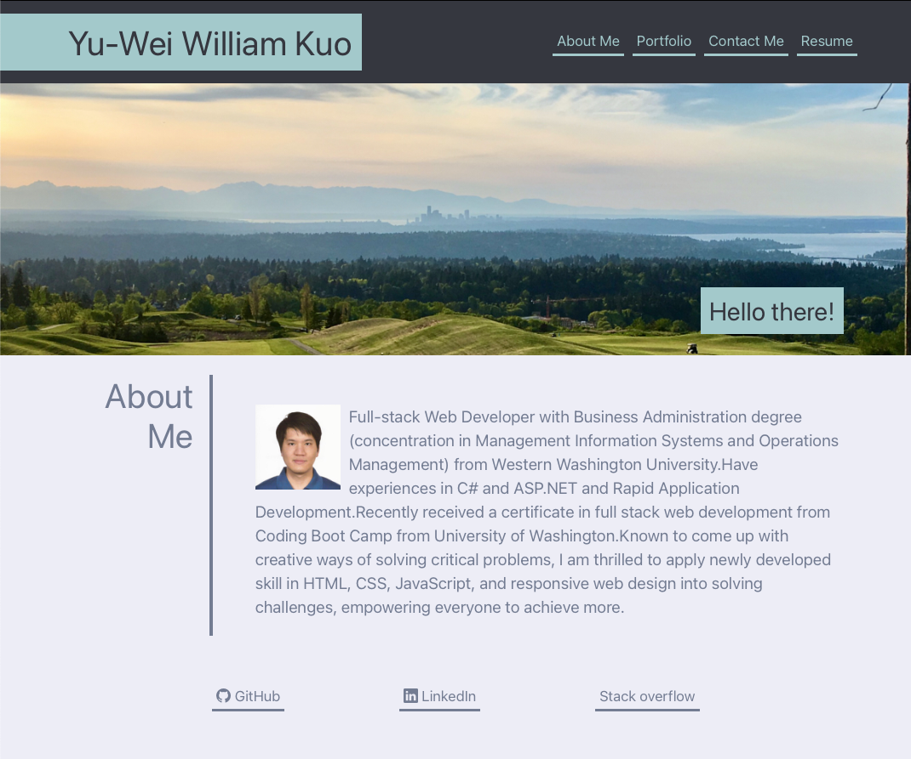

# Yu-Wei William Kuo's Portfolio (React Version)

## Description
This is Yu-Wei "William" Kuo's portfolio to demonstrate William's journey from zero to hero. This page introduces William and showcases his portfolio. The portfolio was created with HTML and CSS knowledges, as well as making use of Flex Box and Responsive Design. Recently reworked and updated using React.

## Table of Contents
- [Screenshot](#screenshot)
- [Link](#link)
- [Updates](#updates)
- [Questions](#questions)

## Screenshot

## Link
https://ywkuo227.github.io/ywk-react-portfolio/

## Updates:
October 2nd:
- Reworked and updated using React.
- Breaking single page content into multiple.

August 29th:
- Updated work portfolio.
- Updated resume.
- Introduced JS to populate portfolio.

June 30th:
- Replaced placeholders with actual portfolio work.
- Added missing links and resume.

May 15th:
- Initial update with placeholders.

## Questions
GitHub: [ywkuo227's GitHub](https://github.com/ywkuo227)

Email: [ywkuo@outlook.com](mailto:ywkuo@outlook.com)